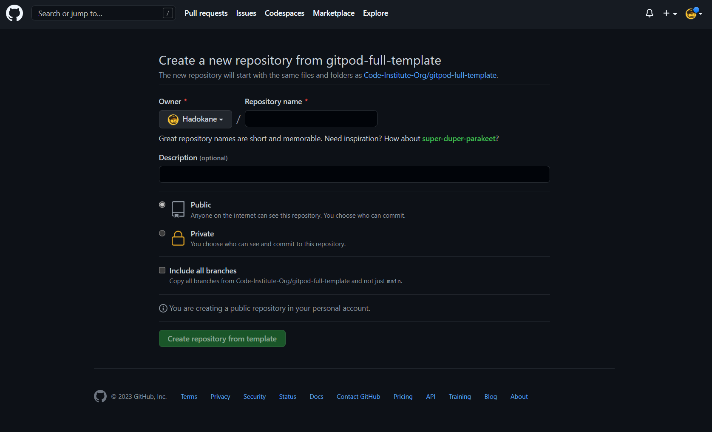
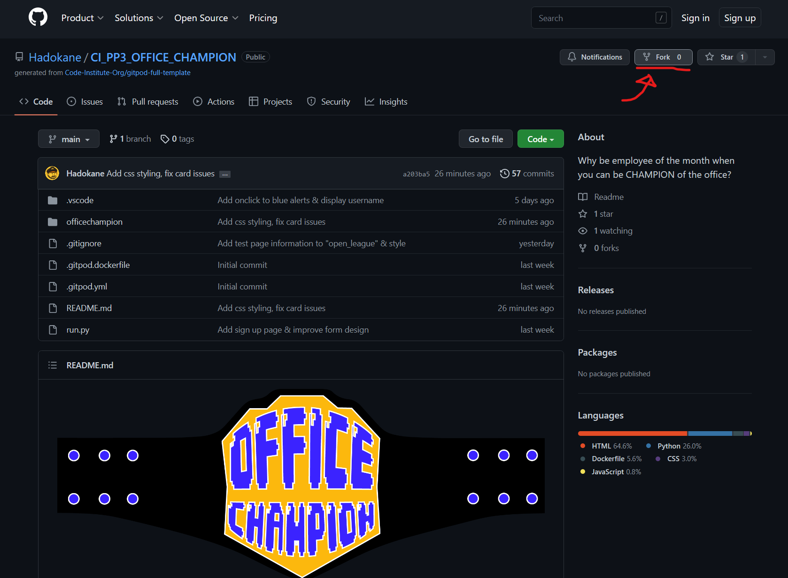
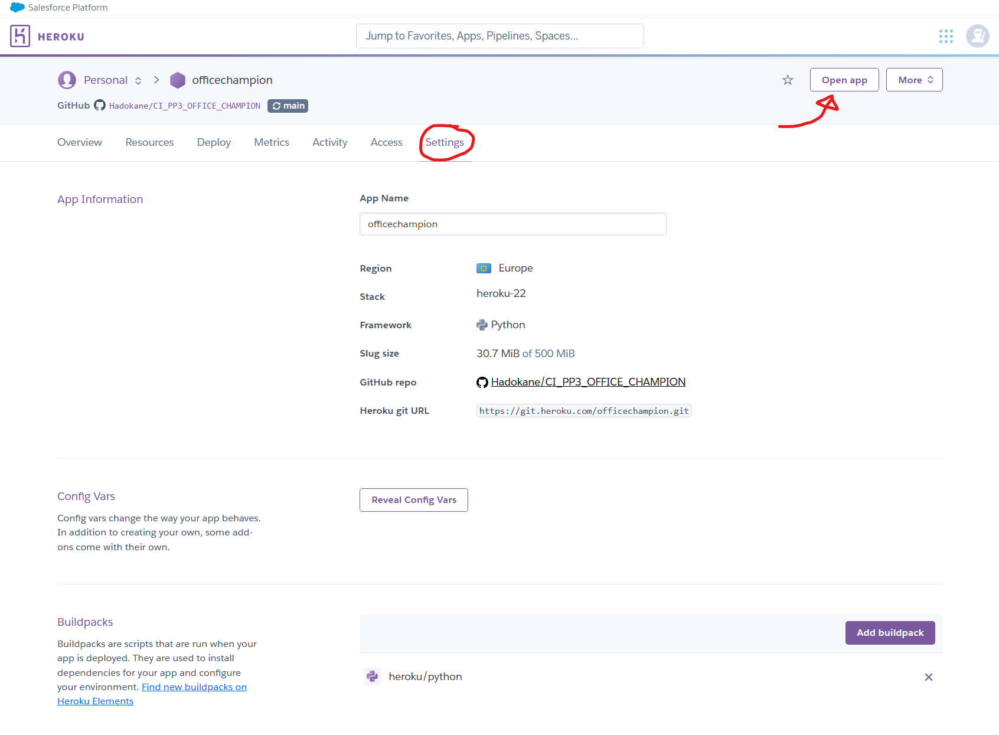

# OFFICE CHAMPION

## FIGHT YOUR FRIENDS - CRUSH YOUR COLLEAGUES - BE THE OFFICE CHAMP!

---

The last update to this file was: **February 23, 2022**

## Gitpod Reminders

To run a frontend (HTML, CSS, Javascript only) application in Gitpod, in the terminal, type:

`python3 -m http.server`

To run a backend Python file, type:

`python3 app.py`

Install plugins/framework:

`pip3 install 'Flask-SQLAlchemy<3' psycopg2 sqlalchemy==1.4.46`

psql in the terminal:

`set_pg`

`psql`

View a user in psql:

`psql -d officechampion`

`TABLE "user";`

---

**Developer Links:**

*(Right-click to open in a new tab/window)*

[Developer - HK_Dev](https://github.com/Hadokane "Hadokane - Github")

[Commit Log](https://github.com/Hadokane/CI_PP2_HUG/commits/main)

**Live Website Link:**

[Live Website](https://github.com/Hadokane "H.U.G. Protocol")

*-add when done-*

**Repository Pages:**

[Repository page - index.html](https://github.com/Hadokane) *-add when done-*

[Repository page - style.css](https://github.com/Hadokane) *-add when done-*

[Repository page - scripts.js](https://github.com/Hadokane) *-add when done-*

---
## Academic Project Aims
---

officechampion=# \dt
        List of relations
 Schema |  Name  | Type  | Owner  
--------+--------+-------+--------
 public | league | table | gitpod
 public | member | table | gitpod
 public | note   | table | gitpod
 public | title  | table | gitpod
 public | user   | table | gitpod
(5 rows)

--------------------
LOGIN INFORMATION 

TEST ACCOUNT:

USERNAME = TESTER

PASSWORD = 12341234

---

## Testing

---

Please refer to the separate Testing document located - [here](TESTING.md)

This contains information on the following sections:
- Validation 
- Manual & Automated Testing of the website 
- Testing of established user stories.

[Back to top ↑](#office-champion)

---

## Deployment

---

### Creating the Gitpod Workspace

---

The project uses the Code Institute Gitpod Template as its foundation. 

This can be accessed by doing the following:

1. Log in to GitHub 
2. Head to the [Code Institute student template](https://github.com/Code-Institute-Org/gitpod-full-template)
2. Click 'Use this Template' next to the Green Gitpod button.
3. Click the "Use this template" button.
4. In the dropdown menu select "Create a new repository".
5. You will be presented with the example screen below.
6. Enter your details & press "Create repository from template"

<details><summary>Example Screen</summary></details>

---

### Forking the GitHub Repository

---

If you would like to fork this GitHub Repository - make a copy of the original on your GitHub account - for viewing or making changes do the following:

1. Log in to GitHub
2. Head to the [Office Champion GitHub Repository](https://github.com/Hadokane/CI_PP3_OFFICE_CHAMPION)
3. Select the "Fork" tab on the right-hand side of the navigation menu.
4. Choose a destination to save your newly forked repository.

<details><summary>Example Screen</summary></details>

For further information on making a local clone of this project, I recommend reading GitHub Docs guide on forking located [here.](https://docs.github.com/en/github-ae@latest/get-started/quickstart/fork-a-repo)

---

### Deploying with Heroku

---

The application was then deployed with Heroku using the following steps:

1. Create an account/Log in to [Heroku](https://dashboard.heroku.com/apps).
2. On the main page select the "New" button and chose "Create new app".
3. Enter a unique name for your project (with no spaces or capitalisation) and select your region (Europe in my case). 
4. Select 'Create App'.
5. Install Heroku into the project by entering ```npm install -g heroku``` into the terminal.
6. Enter ```heroku login -i``` into the terminal and enter your heroku credentials. Due to two-factor authentication being active in my case, I used my Heroku API key instead of my password when connecting. This can be found on your Heroku "manage account" page.
7. Enter ```heroku apps``` in the GitHub Terminal to see a list of your created apps & confirm your created app exists.s
8. Head to the Heroku dashboard "settings" tab for your created project and find the "Heroku git URL" shown there.
9. Copy that URL and paste the following into the GitHub CLI Terminal: ```git remote add heroku your_url``` (replacing your_url with the "Heroku git URL" mentioned above.)
10. Create a "requirements.txt" file by typing ``` pip3 freeze --local > requirements.txt ``` into the Gitpod Command Line Interface Terminal & commit it to GitHub.
11. Create a "Procfile" by typing ```echo web: python run.py > Procfile```. (Ensure the document is a single line & begins with a capital "P" to avoid potential errors.)
12. Use ```git push -u heroku main``` to push the main branch of the project to heroku. (Will fail if the "Procfile" or "requirements.txt" are missing from your project.)
13. Finally enter the following into the "Config Vars" section found on the Heroku Dashboards "Setting" tab. Select the "Reveal Config Vars" button and enter the following:
- ("IP", "0.0.0.0")
- ("PORT", "5000")
- ("SECRET_KEY", "whatever_you_chose_to_enter_here") (*not the actual project secret_key that was used)
14. Press "Open app" on Heroku. 
15. Breathe a sigh of relief, the app is deployed and usable!

<details><summary>Heroku Example Screen</summary></details>

---

### Deploying with ElephantSQL

---

Due to changes in Heroku the PostgreSQL databases created during this project need to be hosted externally.

For this I've used ElephantSQL and will detail the process of deploying the databases here:

1. Navigate to [ElephantSQL](ElephantSQL.com) and click “Get a managed database today”
2. Create an account by connecting to GitHub.
3. Once signed in click the "Create New Instance" button.
4. Name your project, select your region & "Create Instance"
5. Select your project and copy the provided URL.
6. Head to the Heroku Dashboard "Settings" Tab and add the above URL into your "Config Vars"
7. Select the "More" Button next to "Open App" and select "Run Console" in Heroku.
8. Type ```Python3``` into the console and run
9. Finally enter the following:
```from officechampion import db```
```db.create_all()```
10. New empty database have now been created.

[Back to top ↑](#office-champion)

## Reference

(1) https://www.youtube.com/watch?v=dam0GPOAvVI - for creating the sign-up form and his course on Flask & Python in general. Additional knowledge and explanation at a helpful pace.

(2) https://phoenixnap.com/kb/postgresql-drop-database#:~:text=The%20first%20method%20to%20remove,execute%20the%20DROP%20DATABASE%20command. - helped with dropping databases

(3) https://docs.sqlalchemy.org/en/14/errors.html#error-9h9h - Researching error messages within bugs 5 & 6

(4) https://stackoverflow.com/questions/26040493/how-to-show-data-in-a-table-by-using-psql-command-line-interface - How to view contents of a table in SQL, needed "around my table name"

(5) https://flask.palletsprojects.com/en/2.2.x/tutorial/ - Flask documentation
(b) https://flask-login.readthedocs.io/en/latest/#flask_login.UserMixin - Login Management & UserMixin explained

(6) https://jinja.palletsprojects.com/en/3.1.x/api/ - Jinja documentation

(7) https://docs.python.org/3/index.html - Python documentation

(8) https://materializecss.com/ - Materialize framework used throughout

https://hackersandslackers.com/sqlalchemy-data-models/ - Explained how to reference another table's information within a table. 

https://strftime.org/ - strftime information

https://upload.wikimedia.org/wikipedia/commons/thumb/6/65/No-Image-Placeholder.svg/1665px-No-Image-Placeholder.svg.png - Wikipedia creative commons No Image Thumbnail

https://github.com/Dogfalo/materialize/issues/1861 - People discussing the materialize select form issue

https://www.draw.io - for constructing data schema

(slack post here) - for help with displaying specific data using queries 

https://stackoverflow.com/questions/74992148/how-to-write-a-commit-description-in-source-control-vscode - Add longer git commits

Wikipedia & WWE.com for primary imagery
Bungee for Halo imagery
Red bubble for employee of the month imagery.
https://freesvg.org/ - Royalty Free Imagery.

https://fontawesome.com/ - icons

Adobe Illustrator - Used to draw the website logo.