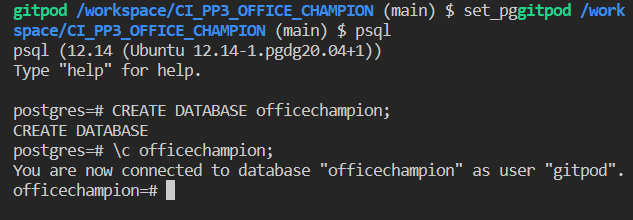

# **OFFICE CHAMPION**

*FIGHT YOUR FRIENDS - CRUSH YOUR COLLEAGUES - BECOME THE OFFICE CHAMPION!*

---


The last update to this file was: **07 March 2023**

---

**Developer Links:**

*(Right-click to open in a new tab/window)*

[Developer - HK_Dev](https://github.com/Hadokane "Hadokane - Github")

[Commit Log](https://github.com/Hadokane/CI_PP3_OFFICE_CHAMPION/commits/main)

**Live Website Link:**

[Live Website - Heroku](https://officechampion.herokuapp.com/ "Office Champion")

**Repository Pages:**

[All HTML Pages - Templates](https://github.com/Hadokane/CI_PP3_OFFICE_CHAMPION/blob/b9e1855fe978f3ab382c4b423dad2887c409c35b/officechampion/templates)

[Repository page - style.css](https://github.com/Hadokane/CI_PP3_OFFICE_CHAMPION/blob/b9e1855fe978f3ab382c4b423dad2887c409c35b/officechampion/static/css/style.css)

[Repository page - scripts.js](https://github.com/Hadokane/CI_PP3_OFFICE_CHAMPION/blob/b9e1855fe978f3ab382c4b423dad2887c409c35b/officechampion/static/js/script.js)

[Repository page - models.py](https://github.com/Hadokane/CI_PP3_OFFICE_CHAMPION/blob/b9e1855fe978f3ab382c4b423dad2887c409c35b/officechampion/models.py)

[Repository page - routes.py](https://github.com/Hadokane/CI_PP3_OFFICE_CHAMPION/blob/b9e1855fe978f3ab382c4b423dad2887c409c35b/officechampion/routes.py)

**Additional Documents**

[Testing Document - Automatic, Manual & User](https://github.com/Hadokane/CI_PP3_OFFICE_CHAMPION/blob/b9e1855fe978f3ab382c4b423dad2887c409c35b/TESTING.md)

**PROVIDED TEST ACCOUNT**

[Provided Test Account](#provided-test-account) - Sign in using this and view an example of an active user profile.

*(Provided for review/examination purposes)*

---
# Academic Project Aims

I am currently pursuing my **Diploma in Web App Development** from [Code Institute](https://codeinstitute.net/ "Code Institute").

The academic aim of this project is to demonstrate my newly developed skills and knowledge of Python by developing a full-stack website with a backend capable of providing full C.R.U.D. functionality to it's user.

As the site owner, I will achieve this goal by providing a database project that "gamifies" the concept of "Employee of the Month," allowing users to Create, Read, Update and Delete their own data in a straightforward manner, that directly meets user-expectations.

I intend to display the above throughout the project via my: coding, comments, commits, and the explanation provided by this README and it's accompanying TESTING document.

Additional functionality has been provided by the framework [Materialize 1.0.0](https://materializecss.com/) for CSS styling & [Flask](https://flask.palletsprojects.com/en/2.2.x/) for it's templating functionality while utilising [Jinja](https://jinja.palletsprojects.com/en/3.0.x/).

Great care has been taken, to ensure that the website is designed to meet best practice standards, and is responsive on all screen resolutions.

The website has been tested on a variety of devices and screen resolutions: from mobiles; to tablets; and 4k monitors. It also has proven compatibility with all popular web browsers.


---
# Table of Contents

1. [User Experience (UX)](#user-experience---ux)
    - [Strategy Plane](#strategy-plane)
    - [Scope Plane](#scope-plane)
    - [Structure Plane](#structure-plane)
    - [Skeleton Plane](#skeleton-plane)
        - [Wireframes](#wireframes)
        - [Database Schema](#database-schema)
    - [Surface Plane](#surface-plane)
1. [Testing](#testing)
        - [Provided Test Account](#provided-test-account)
1. [Deployment](#deployment)
    - [Creating The Gitpod-Workspace](#creating-the-gitpod-workspace)
    - [Forking The Github Repository](#forking-the-github-repository)
    - [Deploying With Heroku](#deploying-with-heroku)
    - [Deploying With ElephantSQL](#deploying-with-elephantsql)
    - [Gitpod CLI Inputs](#gitpod-cli-terminal-inputs)
    - [PostgreSQL Inputs](#postgresql-inputs)
1. [Credits](#credits)
    - [Languages Used](#languages-used)
    - [Frameworks Libraries & Programs Used](#frameworks-libraries-and-programs-used)
    - [Validators Used](#validators-used)
    - [Technologies Used](#technologies-used)
    - [Imagery Used](#imagery-used)
    - [Acknowledgements](#acknowledgements)

---
## AlchemySQL
---

Discuss AlchemySQL and the type of system it is and why I used it.

The following tables were created using AlchemySQL and the Github CLI Terminal to store the necessary information for this project.

 Schema |  Name  | Type  | Owner  
--------|--------|-------|--------
 public | league | table | gitpod
 public | member | table | gitpod
 public | note   | table | gitpod
 public | title  | table | gitpod
 public | user   | table | gitpod

This information is viewable by inputting the following into the Github CLI Terminal when connected to the officechampion database:

```
officechampion=# \dt
```

[Back to top ↑](#office-champion)

---

# Testing

**[--> Please refer to the separate Testing document located here <--](TESTING.md)**

**Clicking the above link will open "TESTING.MD"*

**This document contains information on the following:**
- Website Validation 
- Manual & Automated Testing of code & features 
- Device Testing
- Testing established user stories
- Confirmation of user stories & site goals
- Bug Reports

---

## Provided Test Account

---

The following account is pre-loaded with examples of different case-uses for the Office Champion website.

Examiners are welcome to login using the following information and be greeted by with an example of an active user account, with multiple leagues, titles and members.

**TEST ACCOUNT LOGIN INFORMATION**

```
Username = Tester

Password = 12341234
```

*Alternatively feel free to make your own account and populate it as you see fit. I'm confident the website will meet your expectations and provide a user-friendly experience.*

[Back to top ↑](#office-champion)

---

# Deployment

---

## Creating the Gitpod Workspace

---

The project uses the Code Institute Gitpod Template as its foundation. 

This can be accessed by doing the following:

1. Log in to GitHub 
2. Head to the [Code Institute student template](https://github.com/Code-Institute-Org/gitpod-full-template)
2. Click 'Use this Template' next to the Green Gitpod button.
3. Click the "Use this template" button.
4. In the dropdown menu select "Create a new repository".
5. You will be presented with the example screen below.
6. Enter your details & press "Create repository from template"

<details><summary>Example Screen</summary></details>

---

## Forking the GitHub Repository

---

If you would like to fork this GitHub Repository - make a copy of the original on your GitHub account - for viewing or making changes do the following:

1. Log in to GitHub
2. Head to the [Office Champion GitHub Repository](https://github.com/Hadokane/CI_PP3_OFFICE_CHAMPION)
3. Select the "Fork" tab on the right-hand side of the navigation menu.
4. Choose a destination to save your newly forked repository.

<details><summary>Example Screen</summary></details>

For further information on making a local clone of this project, I recommend reading GitHub Docs guide on forking located [here.](https://docs.github.com/en/github-ae@latest/get-started/quickstart/fork-a-repo)

---

## Deploying with Heroku

---

The application was then deployed with Heroku using the following steps:

1. Create an account/Log in to [Heroku](https://dashboard.heroku.com/apps).
2. On the main page select the "New" button and chose "Create new app".
3. Enter a unique name for your project (with no spaces or capitalisation) and select your region (Europe in my case). 
4. Select 'Create App'.
5. Install Heroku into the project by entering ```npm install -g heroku``` into the terminal.
6. Enter ```heroku login -i``` into the terminal and enter your heroku credentials. Due to two-factor authentication being active in my case, I used my Heroku API key instead of my password when connecting. This can be found on your Heroku "manage account" page.
7. Enter ```heroku apps``` in the GitHub Terminal to see a list of your created apps & confirm your created app exists.s
8. Head to the Heroku dashboard "settings" tab for your created project and find the "Heroku git URL" shown there.
9. Copy that URL and paste the following into the GitHub CLI Terminal: ```git remote add heroku your_url``` (replacing your_url with the "Heroku git URL" mentioned above.)
10. Create a "requirements.txt" file by typing ``` pip3 freeze --local > requirements.txt ``` into the Gitpod Command Line Interface Terminal & commit it to GitHub.
11. Create a "Procfile" by typing ```echo web: python run.py > Procfile```. (Ensure the document is a single line & begins with a capital "P" to avoid potential errors.)
12. Use ```git push -u heroku main``` to push the main branch of the project to heroku. (Will fail if the "Procfile" or "requirements.txt" are missing from your project.)
13. Finally enter the following into the "Config Vars" section found on the Heroku Dashboards "Setting" tab. Select the "Reveal Config Vars" button and enter the following:
- ("IP", "0.0.0.0")
- ("PORT", "5000")
- ("SECRET_KEY", "whatever_you_chose_to_enter_here") (*not the actual project secret_key that was used)
14. Press "Open app" on Heroku. 
15. Breathe a sigh of relief, the app is deployed and usable!

<details><summary>Heroku Example Screen</summary></details>

---

## Deploying with ElephantSQL

---

Due to changes in Heroku the PostgreSQL databases created during this project need to be hosted externally.

For this I've used ElephantSQL and will detail the process of deploying the databases here:

1. Navigate to [ElephantSQL](ElephantSQL.com) and click “Get a managed database today”
2. Create an account by connecting to GitHub.
3. Once signed in click the "Create New Instance" button.
4. Name your project, select your region & "Create Instance"
5. Select your project and copy the provided URL.
6. Head to the Heroku Dashboard "Settings" Tab and add the above URL into your "Config Vars"
7. Select the "More" Button next to "Open App" and select "Run Console" in Heroku.
8. Type ```Python3``` into the console and run
9. Finally enter the following:
```from officechampion import db```
```db.create_all()```
10. New empty database have now been created.

---

## Gitpod CLI Terminal Inputs

---

To run a frontend (HTML, CSS, Javascript only) application in Gitpod, in the terminal, type:

`python3 -m http.server`

To run a backend Python file, type:

`python3 app.py`

Install necessary plugins/framework for this project:

`pip3 install 'Flask-SQLAlchemy<3' psycopg2 sqlalchemy==1.4.46`

---

## PostgreSQL Inputs

---

**Initialise Postgresql (psql) in the terminal:**
```
set_pg

psql
```

**View a user in psql:**
```
psql -d officechampion

TABLE "user";
```

<details><summary>PSQL - Create & connect to a Database</summary></details>

**Add the table information from "models.py" to the psql "officechampion" database:**
```
from officechampion import db

db.create_all()
```

<details><summary>PSQL - Confirm the Database contains the correct information </summary></details>

[Back to top ↑](#office-champion)

---

# Credits 

## Languages Used:
---

- HTML 5
- CSS 3
- Javascript ES2022
- Python 3

--- 
## Frameworks Libraries and Programs Used:
---

- [Heroku](https://heroku.com/)
  - Heroku is used for the deployment & hosting of this project.

- [ElephantSQL](ElephantSQL.com)
  - For hosting the PostgreSQL database for Heroku to access.

- [PostgreSQL](https://www.postgresql.org/)
    - Was utilised as my Relational Database Management System of choice during the project.

- [SQLAlchemy](https://docs.sqlalchemy.org/en/20/)
    - Used as a console language to populate and manage my Relational Databases.
    - Allows use of PostgreSQL.

- [Flask](https://flask.palletsprojects.com/en/2.2.x/)
  - Python library used with the Jinja language in order to create HTML template files & run python code within HTML.

- [Jinja](https://jinja.palletsprojects.com/en/3.1.x/api/)
  - Required for Flask functionality. The templating language used within the HTML template files.

- [Materialize 1.0.0](https://materializecss.com/)
  - Front-end library utilised for it's useful CSS functionality. Used throughout the website on elements such as: forms, cards, nav bars and colour pallette selection.

- [Google Fonts](https://fonts.google.com/)
  - Used to import the "Golos Text" font.
  - Used to import material icons.
  
- [Font Awesome](https://fontawesome.com/)
  - Used to import additional form icons.

- [Github](https://github.com/)
  - Github stores my projects repository.
  - Provides a method for me to submit my project data for examination purposes.

- [Gitpod](https://gitpod.io/)
  - Gitpod served as my online-IDE during the project.

- [Git](https://git-scm.com/)
  - Git is used in conjunction with the above for version control.

- [Draw io](https://www.draw.io)
  - Used to create Wireframes & Database Schema for the project during development.

- [Adobe Illustrator](https://www.adobe.com/)
  - Illustrator was used to create the websites logo image.

- [Google Chrome Dev Tools](https://developer.chrome.com/docs/devtools/)
  - Chrome's Dev Tools were essential during the development of this project.
  - They allowed me to test the responsiveness across various screen sizes during creation.
  - Provided near endless opportunities for debugging and bug identification throughout the projects dev-cycle.

- [CI TEMPLATE](https://github.com/Code-Institute-Org/gitpod-full-template)
  - This repository was initially created using Code Institute's Github template.

---
## Validators Used:
---

- [W3C HTML Validator](https://validator.w3.org/) - Validation of HTML.
- [W3C JigSaw Validator](https://jigsaw.w3.org/css-validator/) - Validation of CSS.
- [JSHint Validator](https://jshint.com/) - Validation of Javascript.
- [Code Institute Python Linter](https://pep8ci.herokuapp.com/) - Validation of Python (Pep 8).
- [Wave Web Accessibility Evaluation Tool](https://wave.webaim.org/) - Accessibility testing.
- [A11y Color Contrast Accessibility Validator](https://color.a11y.com/Contrast/) - Contrast testing.
- [Lighthouse & Chrome DevTools](https://developer.chrome.com/docs/devtools/) - Performance testing.

---
## Technologies Used:
---

1. [Markdown Guide](https://www.markdownguide.org/cheat-sheet/) - For their "Markdown Cheat Sheet" and assistive documents on writing a README.md file.

1. [Strftime](https://strftime.org/) - "strftime python Cheat Sheet."

1. [Grammarly](https://app.grammarly.com/) - For spell-checking my Text Based Adventure Module during brainstorming.

1. [Am I Responsive](https://ui.dev/amiresponsive) - For providing the mock-up image featured at the top of this document.

1. [Favicon.io](https://favicon.io/) - For providing a favicon image for the project.

1. [Youtube: Tech With Tim](https://www.youtube.com/watch?v=dam0GPOAvVI) - For his stellar course on Flask & Python. Provided additional knowledge and explanation at a helpful pace. Responsible largely for the note and sign-up functionality of the website.

1. [Youtube: Codemy](https://www.youtube.com/@Codemycom) - Additional useful series on Flask & Python. Provided a good explanation of SQLAlchemy.

1. [Flask Login Information](https://flask-login.readthedocs.io/en/latest/#flask_login.UserMixin) - Login Management & UserMixin documentation. Explained the use cases for both.

1. [StackOverflow - Longer Git Commit Article](https://stackoverflow.com/questions/74992148/how-to-write-a-commit-description-in-source-control-vscode) - Information on adding comments to Git Commits.

1. [StackOverflow - psql Table Data Article](https://stackoverflow.com/questions/26040493/how-to-show-data-in-a-table-by-using-psql-command-line-interface) - Showed terminal commands for viewing table contents.

1. [Phoenixap - Drop Database Article](https://phoenixnap.com/kb/postgresql-drop-database#:~:text=The%20first%20method%20to%20remove,execute%20the%20DROP%20DATABASE%20command) - Provided an explanation on dropping PostgreSQL databases. After updating `methods.py` I needed these changes reflected in the database, this article explained how to do that.

1. [Hackers & Slackers - SQL Data Models Article](https://hackersandslackers.com/sqlalchemy-data-models/) - Deeper look at "One-to-Many" Database Table Relationships.

1. [SQLAlchemy Error Messages](https://docs.sqlalchemy.org/en/14/errors.html#error-9h9h) - Researching error messages within bugs 5 & 6.

1. [Github - Materialize Select Form Issue](https://github.com/Dogfalo/materialize/issues/1861) - People discussing the materialize select form issue. Select form doesn't prompt the user when no input is present.

---
## Imagery Used:
---

1. [WikiCommons - No Image Placeholder](https://upload.wikimedia.org/wikipedia/commons/thumb/6/65/No-Image-Placeholder.svg/1665px-No-Image-Placeholder.svg.png) - Wikipedia Creative Commons "No Image" Thumbnail. Used as a placeholder when no image is provided to "Members" or "Titles" during creation or editing.

1. [WWE.com - for Test Group Imagery](https://wwe.com/)

1. [Credit to Microsoft/Xbox Game Studio - for Halo Imagery](https://www.microsoft.com/en-gb/store/collections/halocollection)

1. [FreeSVG - Additional Royalty Free Imagery](https://freesvg.org/)

---
## Acknowledgements
---

With thanks to:
- My family and friends - For providing some great feedback and user-testing across multiple devices and browsers.

- Code Institute & their wider "Slack" community - For providing me with the necessary skills, knowledge and guidance to execute this project.

- Ed Bradley - For suggesting I look into "Query Filters" when I asked a project related question on Slack. Put me on the right path to getting specific data to show on a page when called rather than all table data.

- Tech With Tim - A youtube with fantastic courses on Flask & Python. A huge help when getting sign up functionality working on this website.

[Back to top ↑](#office-champion)

---