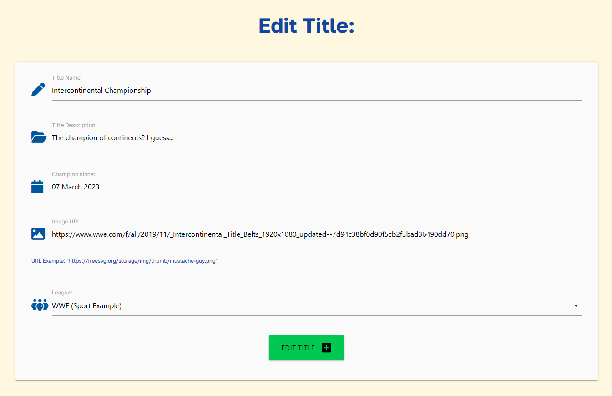
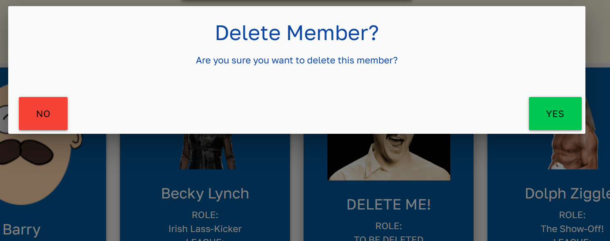

# **Testing Document**

The Office Champion app has undergone numerous tests - both automated and manual - along with numerous validation methods in order to ensure it functions as intended and provides a positive user experience throughout.

---

# Contents

- [Code Validation](#code-validation)
    - [W3C HTML Validator](#w3c-html-validation) 
    - [W3C CSS Validator](#w3c-css-validation)
    - [JSHint Validator](#jshint-validation)
    - [CI Python Linter](#ci-python-linter)
    - [Wave Validator](#wave-validator)
    - [A11y Contrast Validator](#a11y-contrast-validator)
    - [Lighthouse](#lighthouse)
- [Device Testing](#device-testing)
- [Manual Testing](#manual-testing)
- [Testing User Stories](#testing-user-stories)
    - [First Time User](#first-time-user)
    - [Returning User](#returning-user)
    - [Website Owner](#website-owner)
- [Bugs](#bugs)

Return to [README.md ↑](/README.md#testing)

---

# Code Validation

## W3C HTML Validation

-  [W3C HTML Validator](https://validator.w3.org/)

I began my validation by running the website's HTML through W3C's Validation Service.

<details><summary>W3C HTML Validation - Errors</summary></details>

I initially encountered the following errors:

- Closing tags were present at the end of `````` & ```<nav>``` tags throughout the website.
- There were two instances where outer tags had been closed before their inner tags, leading to errors.

After fixing the above issues & resubmitting the website for validation, I received the following passing result and was able to continue onto further validation methods.

<details><summary>W3C HTML Validation - Pass</summary></details>

---

## W3C CSS Validation

- [W3C CSS Jigsaw Validator](https://jigsaw.w3.org/css-validator/)

Next, I carried out validation of the CSS file by running the page through W3C CSS Validation Service - Jigsaw.

<details><summary>W3C CSS Pass</summary></details>

The results came back successfully.

---

## JSHINT Validation

- [JSHint Validator](https://jshint.com/)

I utilised JSHint as a validation tool to help detect if there were any errors or potential problems within my JavaScript code.

<details><summary>JSHint Validation</summary></details>

- The undefined variables were all required by Materialize's inbuilt components to initialise forms and other components.

- The removeNode function is called from within HTML pages whenever an alert is clicked by the user. This allows users to close alert pop-ups.

---

## CI Python Linter

- [Code Institute Python Linter - Pep8 Validator](https://pep8ci.herokuapp.com/)

I used Code Institute's Python Linter to check the validity of my code based on Pep 8 styling standards.

I ran each Python page individually through the linter. With each returning a result of: "All clear, no errors found."

<details><summary>Python Lint for - "__init__.py"</summary></details>
<details><summary>Python Lint for - "models.py"</summary></details>
<details><summary>Python Lint for - "routes.py"</summary></details>
<details><summary>Python Lint for - "run.py"</summary></details>

---

## Wave Validator

- [Wave Web Accessibility Evaluation Tool](https://wave.webaim.org/)

This was used to check that the Office Champion website was accessible to as many individuals needs as possible.

On an initial scan I discovered the following accessibility errors:
- The Materialize default of white text on an amber background was actually being flagged as a contrast issue.
- Underlining being used on page headers wasn't best practice. A user could easily mistake this for a hyperlink.
- The home button contained the same link as the adjacent "Office Champions" Hero Image, that was included in the navbar. Repeating adjacent links seemed unnecessary to Wave.

<details><summary>Wave Error #1</summary></details>

<details><summary>Wave Error #2</summary></details>

To fix the above issues:
- I recoloured all menu and navigation text to black. Providing adequate contrast for users.
- I removed all underlining throughout the websites headers.

I also decided to keep the "redundant" additional navigation link of "home". My reasoning being that most users will expect the navbar icon to take them home as this is an extremely common feature across numerous websites. The addition of the written "home" button will provide a means of getting to the home page for users without this expectation without harming the website or other users.

After carrying out the above steps, Office Champion passed Wave validation.

<details><summary>Wave Validation Pass</summary></details>

---

## A11y Contrast Validator

- [A11y Color Contrast Accessibility Validator](https://color.a11y.com/Contrast/)

This was used to ensure the websites colour contrast met WCAG 2.1 Guidelines.

An initial check showed that the burger menu icon on the side-nav bar was a contrast issue. I recoloured this icon from white to black, fixing the issue.

<details><summary>A11y Validation Pass</summary></details>

---

## Lighthouse

- [Google Chrome Lighthouse Validator](https://developer.chrome.com/docs/lighthouse/overview/)

I utilised Lighthouse to run audits to check the performance, accessibility & SEO of my website.

I was reminded to add ```<Meta>``` tags to my base template's head to provide a description of my website, improving it's SEO potential.

After doing the above, Office Champion received very favourable results on both it's Desktop and Mobile audits.

<details><summary>Lighthouse Desktop Pass</summary></details>

<details><summary>Lighthouse Mobile Pass</summary></details>

Return to [Top ↑](/TESTING.md#testing)

---

# Device Testing

The website was tested and functioned as expected on the following devices:

- Novatech LTD. AMD Ryzen 7 3800x, 32GB Desktop
- Lenovo IdeaPad 5 Pro
- Samsung Galaxy S20 & S21
- Samsung Galaxy Tab S7
- MacBook Air with M1 chip
- iPhone 11, 13 & 14
- iPad Air
- Samsung Chrome Book

The website has been tested on up-to-date versions of the following browsers:

- Microsoft Edge
- Google Chrome
- Chrome for android
- Mozilla Firefox
- Opera
- Safari
- Internet Explorer
- Duck Duck Go

The website has also been tested on monitors of 16:9, 16:10 and 21:9 resolutions.

Return to [Top ↑](/TESTING.md#testing)

---

# Manual Testing

From ensuring buttons led to the correct destination to testing if a user could access another users information, manual testing played a crucial role in the development of this website.

It has been carried out at each step of development through the use of Chrome Dev Tools for bug solving and finding missing tags, to user testing where friends, family and forum members helped to stress test the website and find any oversights I could fix.

Once the project had reached it's developmental conclusion I compiled a list of my main concerns to check through before proceeding any further. I would need to ensure the website provides the user full C.R.U.D. functionality on each feature page, the sign-up & login pages work without a hitch and that alerts are present to provide guiding user feedback.

The following would need to all be checked thoroughly and work without error, in order for me to feel I'd met my previously outlined User & Site Owner Goals. Through this I feel I can ensure that I've satisfied my project brief and provided a fully functional full-stack website, fit for consumption by multiple users.

(I have included an image or description proving the testing was successful for each website element below.)

---
1. Can the user create a new account?

**Passes Testing:** Here we create a new user account called "Jerome" successfully.

<details><summary>Sign Up - Jerome Information</summary></details>

<details><summary>Sign Up - Confirmation</summary></details>
---

2. Is the user warned of incorrect information during sign up?

**Passes Testing:** Alerts display to tell the user the exact issue preventing sign up.

<details><summary>Alert - Username too short</summary></details>

<details><summary>Alert - Password too short</summary></details>

<details><summary>Alert - Passwords don't match</summary></details>

<details><summary>Alert - Username in use</summary></details>

---

3. Can alerts be closed?

**Passes Testing:** The below images show an Alert before and after a user clicks on it. The alert closes due to a JavaScript function that is ran `onClick`.

<details><summary>Alert - Open</summary></details>

<details><summary>Alert - After click</summary></details>

---

4. Is the user able to Create elements on each of the feature pages?

**Passes Testing:** This was tested on each section of the website - Titles, Members, Leagues & Notes. Imagery is provided showing each step of each process below.

*(Add champion refers to adding a member with a title.)*

<details><summary>Add League #1</summary></details>

<details><summary>Add League #2</summary></details>
-
<details><summary>Add Champion #1</summary></details>

<details><summary>Add Champion #2</summary></details>

<details><summary>Add Champion #3</summary></details>
-
<details><summary>Add Member #1</summary></details>

<details><summary>Add Member #2</summary></details>
-
<details><summary>Add Note #1</summary></details>

<details><summary>Add Note #2</summary></details>
-
<details><summary>Add Title #1</summary></details>

<details><summary>Add Title #2</summary></details>

<details><summary>Add Title #3</summary></details>

---

5. Is the user able to Read elements on each of the feature pages?

**Passes Testing:** Each feature page of the website includes a "View" are displaying all of the users created information

<details><summary>View Leagues</summary></details>
-
<details><summary>View Members</summary></details>
-
<details><summary>View Notes</summary></details>
-
<details><summary>View Titles</summary></details>

---

6. Is the user able to Update elements on each of the feature pages?

**Passes Testing:** Each feature page includes a button to edit a created element. Below are the results of my testing.

<details><summary>Edit League #1</summary></details>

<details><summary>Edit League #2</summary></details>

<details><summary>Edit League #3</summary></details>
-
<details><summary>Edit Member #1</summary></details>

<details><summary>Edit Member #2</summary></details>

<details><summary>Edit Member #3</summary></details>
-
<details><summary>Edit Note #1</summary></details>

<details><summary>Edit Note #2</summary></details>

<details><summary>Edit Note #3</summary></details>

<details><summary>Edit Note #4</summary></details>
-
<details><summary>Edit Title #1</summary></details>

<details><summary>Edit Title #2</summary></details>

<details><summary>Edit Title #3</summary></details>

<details><summary>Edit Title #4</summary></details>

---

7. Is the user able to Delete elements on each of the feature pages?

**Passes Testing:** Each feature page includes a button to delete a created element. Below are the results of my testing.

<details><summary>Delete League #1</summary></details>

<details><summary>Delete League #2</summary></details>

<details><summary>Delete League #3</summary></details>
-
<details><summary>Delete Member #1</summary></details>

<details><summary>Delete Member #2</summary></details>

<details><summary>Delete Member #3</summary></details>

<details><summary>Delete Member #4</summary></details>
-
<details><summary>Delete Note #1</summary></details>

<details><summary>Delete Note #2</summary></details>

<details><summary>Delete Note #3</summary></details>
-
<details><summary>Delete Title #1</summary></details>

<details><summary>Delete Title #2</summary></details>

<details><summary>Delete Title #3</summary></details>

---

8. Is the user able to Log in to an existing account?

**Passes Testing:** The provided **"Tester"** account was used for these - and almost all other - demonstrations.

<details><summary>Login #1</summary></details>

<details><summary>Login #2</summary></details>

<details><summary>Login #3</summary></details>

---

9. Is the user able to Log out an existing account?

**Passes Testing:**

<details><summary>Logout #1</summary></details>

<details><summary>Login #2</summary></details>

---

10. Can users see other users data? 

The above examples were all carried out using the **"Tester"** account, we are signing in below with the **"Jerome"** account shown in the initial `Can a user create an account` section. This user shouldn't be able to see **"Tester's"** created information in their own feature pages.

**Passes Testing:** All of Jerome's Feature pages are blank, meaning he cannot see Tester's information.

<details><summary>Can users see others data? #1</summary></details>

<details><summary>Can users see others data? #2</summary></details>

<details><summary>Can users see others data? #3</summary></details>

<details><summary>Can users see others data? #4</summary></details>

---

11. Can users login on other devices and access their same information? SHOW TESTER ACCOUNT ON PHONE - TAKE WEBCAM PHOTO.

**Passes Testing:** **"Tester's"** information is available on a mobile device despite being created on a different laptop device.

<details><summary>Phone Tester #1</summary></details>

<details><summary>Phone Tester #2</summary></details>

<details><summary>Phone Tester #3</summary></details>

<details><summary>Phone Tester #4</summary></details>

Return to [Top ↑](/TESTING.md#testing)

---

# Testing User Stories

Here we will test our previously defined user stories.

---

## First-time User

dgdsgdsg

---

## Returning User

dgsdgds

---

## Website Owner

dgsgds

Return to [Top ↑](/TESTING.md#testing)


Return to [Top ↑](/TESTING.md#testing)

Return to [README.md ↑](/README.md#testing)

---