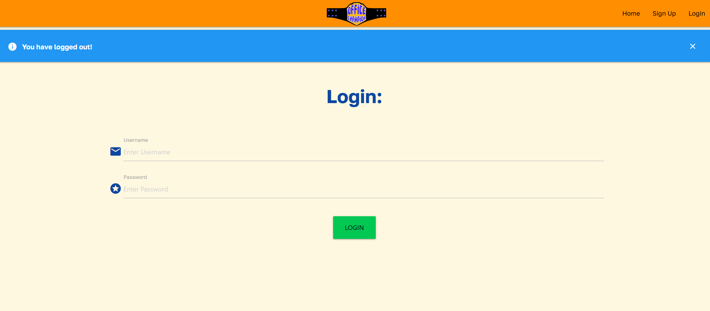
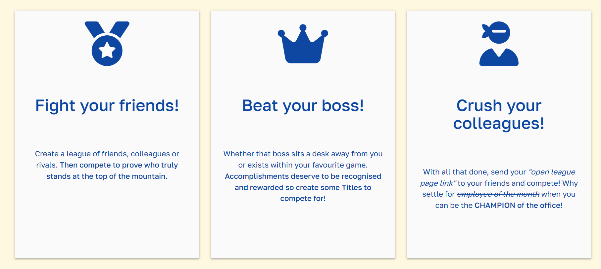

# **Testing Document**

The Office Champion app has undergone numerous tests - both automated and manual - along with numerous validation methods in order to ensure it functions as intended and provides a positive user experience throughout.

---

# Contents

- [Code Validation](#code-validation)
    - [W3C HTML Validator](#w3c-html-validation) 
    - [W3C CSS Validator](#w3c-css-validation)
    - [JSHint Validator](#jshint-validation)
    - [CI Python Linter](#ci-python-linter)
    - [Wave Validator](#wave-validator)
    - [A11y Contrast Validator](#a11y-contrast-validator)
    - [Lighthouse](#lighthouse)
- [Device Testing](#device-testing)
- [Manual Testing](#manual-testing)
- [Testing User Stories](#testing-user-stories)
    - [First Time User](#first-time-user)
    - [Returning User](#returning-user)
    - [Website Owner](#website-owner)
- [Bugs](#bugs)

---

# Code Validation

## W3C HTML Validation

-  [W3C HTML Validator](https://validator.w3.org/)

I began my validation by running the website's HTML through W3C's Validation Service.

<details><summary>W3C HTML Validation - Errors</summary></details>

I initially encountered the following errors:

- Closing tags were present at the end of `````` & ```<nav>``` tags throughout the website.
- There were two instances where outer tags had been closed before their inner tags, leading to errors.

After fixing the above issues & resubmitting the website for validation, I received the following passing result and was able to continue onto further validation methods.

<details><summary>W3C HTML Validation - Pass</summary></details>

---

## W3C CSS Validation

- [W3C CSS Jigsaw Validator](https://jigsaw.w3.org/css-validator/)

Next, I carried out validation of the CSS file by running the page through W3C CSS Validation Service - Jigsaw.

<details><summary>W3C CSS Pass</summary></details>

The results came back successful.

---

## JSHINT Validation

- [JSHint Validator](https://jshint.com/)

I utilised JSHint as a validation tool to help detect if there were any errors or potential problems within my JavaScript code.

<details><summary>JSHint Validation</summary></details>

- The undefined variables were all required by Materialize's inbuilt components to initialise forms and other components.

- The removeNode function is called from within HTML pages whenever an alert is clicked by the user. This allows users to close alert pop-ups.

---

## CI Python Linter

- [Code Institute Python Linter - Pep8 Validator](https://pep8ci.herokuapp.com/)

I used Code Institute's Python Linter to check the validity of my code based on Pep 8 styling standards.

I ran each Python page individually through the linter. With each returning a result of: "All clear, no errors found."

<details><summary>Python Lint for - "__init__.py"</summary></details>
<details><summary>Python Lint for - "models.py"</summary></details>
<details><summary>Python Lint for - "routes.py"</summary></details>
<details><summary>Python Lint for - "run.py"</summary></details>

---

## Wave Validator

- [Wave Web Accessibility Evaluation Tool](https://wave.webaim.org/)

This was used to check that the Office Champion website was accessible to as many individuals' needs as possible.

On an initial scan, I discovered the following accessibility errors:
- The Materialize default of white text on an amber background was actually being flagged as a contrast issue.
- Underlining being used on page headers wasn't the best practice. A user could easily mistake this for a hyperlink.
- The home button contained the same link as the adjacent "Office Champions" Hero Image, that was included in the navbar. Repeating adjacent links seemed unnecessary to Wave.

<details><summary>Wave Error #1</summary></details>

<details><summary>Wave Error #2</summary></details>

To fix the above issues:
- I recoloured all menu and navigation text to black. Providing adequate contrast for users.
- I removed all underlining throughout the website's headers.

I also decided to keep the "redundant" additional navigation link of "home". My reasoning is that most users will expect the navbar icon to take them home as this is an extremely common feature across numerous websites. The addition of the written "home" button will provide a means of getting to the home page for users without this expectation without harming the website or other users.

After carrying out the above steps, Office Champion passed Wave validation.

<details><summary>Wave Validation Pass</summary></details>

---

## A11y Contrast Validator

- [A11y Color Contrast Accessibility Validator](https://color.a11y.com/Contrast/)

This was used to ensure the website's colour contrast met WCAG 2.1 Guidelines.

An initial check showed that the burger menu icon on the side-nav bar was a contrast issue. I recoloured this icon from white to black, fixing the issue.

<details><summary>A11y Validation Pass</summary></details>

---

## Lighthouse

- [Google Chrome Lighthouse Validator](https://developer.chrome.com/docs/lighthouse/overview/)

I utilised Lighthouse to run audits to check the performance, accessibility & SEO of my website.

I was reminded to add ```<Meta>``` tags to my base template's head to provide a description of my website, improving its SEO potential.

After doing the above, Office Champion received very favourable results on both its Desktop and Mobile audits.

<details><summary>Lighthouse Desktop Pass</summary></details>

<details><summary>Lighthouse Mobile Pass</summary></details>

[Back to Top ↑](#testing-document)

---

# Device Testing

The website was tested and functioned as expected on the following devices:

- Novatech LTD. AMD Ryzen 7 3800x, 32GB Desktop
- Lenovo IdeaPad 5 Pro
- Samsung Galaxy S20 & S21
- Samsung Galaxy Tab S7
- MacBook Air with M1 chip
- iPhone 11, 13 & 14
- iPad Air
- Samsung Chrome Book

The website has been tested on up-to-date versions of the following browsers:

- Microsoft Edge
- Google Chrome
- Chrome for android
- Mozilla Firefox
- Opera
- Safari
- Internet Explorer
- Duck Duck Go

The website has also been tested on monitors of 16:9, 16:10 and 21:9 resolutions.

[Back to Top ↑](#testing-document)

---

# Manual Testing

From ensuring buttons led to the correct destination to testing if a user could access another user's information, manual testing played a crucial role in the development of this website.

It has been carried out at each step of development through the use of Chrome Dev Tools for bug solving and finding missing tags, to user testing where friends, family and forum members helped to stress test the website and find any oversights I could fix.

Once the project had reached its developmental conclusion I compiled a list of my main concerns to check through before proceeding any further. I would need to ensure the website provides the user with full C.R.U.D. functionality on each feature page, the sign-up & login pages work without a hitch and that alerts are present to provide guiding user feedback.

The following would need to all be checked thoroughly and work without error, in order for me to feel I'd met my previously outlined User & Site Owner Goals. Through this, I feel I can ensure that I've satisfied my project brief and provided a fully functional full-stack website, fit for consumption by multiple users.

(I have included an image or description proving the testing was successful for each website element below.)

---
1. Can the user create a new account?

**Passes Testing:** Here we create a new user account called "Jerome" successfully.

<details><summary>Sign Up - Jerome Information</summary></details>

<details><summary>Sign Up - Confirmation</summary></details>

---

2. Is the user warned of incorrect information during sign-up?

**Passes Testing:** Alerts display to tell the user the exact issue preventing sign-up.

<details><summary>Alert - Username too short</summary></details>

<details><summary>Alert - Password too short</summary></details>

<details><summary>Alert - Passwords don't match</summary></details>

<details><summary>Alert - Username in use</summary></details>

---

3. Can alerts be closed?

**Passes Testing:** The below images show an Alert before and after a user clicks on it. The alert closes due to a JavaScript function that is run `onClick`.

<details><summary>Alert - Open</summary></details>

<details><summary>Alert - After click</summary></details>

---

4. Is the user able to Create elements on each of the feature pages?

**Passes Testing:** This was tested on each section of the website - Titles, Members, Leagues & Notes. Imagery is provided showing each step of each process below.

*(Add champion refers to adding a member with a title.)*

<details><summary>Add League #1</summary></details>

<details><summary>Add League #2</summary></details>
-
<details><summary>Add Champion #1</summary></details>

<details><summary>Add Champion #2</summary></details>

<details><summary>Add Champion #3</summary></details>
-
<details><summary>Add Member #1</summary></details>

<details><summary>Add Member #2</summary></details>
-
<details><summary>Add Note #1</summary></details>

<details><summary>Add Note #2</summary></details>
-
<details><summary>Add Title #1</summary></details>

<details><summary>Add Title #2</summary></details>

<details><summary>Add Title #3</summary></details>

---

5. Is the user able to Read elements on each of the feature pages?

**Passes Testing:** Each feature page of the website includes a "View" are displaying all of the user's created information

<details><summary>View Leagues</summary></details>
-
<details><summary>View Members</summary></details>
-
<details><summary>View Notes</summary></details>
-
<details><summary>View Titles</summary></details>

---

6. Is the user able to Update elements on each of the feature pages?

**Passes Testing:** Each feature page includes a button to edit a created element. Below are the results of my testing.

<details><summary>Edit League #1</summary></details>

<details><summary>Edit League #2</summary></details>

<details><summary>Edit League #3</summary></details>
-
<details><summary>Edit Member #1</summary></details>

<details><summary>Edit Member #2</summary></details>

<details><summary>Edit Member #3</summary></details>
-
<details><summary>Edit Note #1</summary></details>

<details><summary>Edit Note #2</summary></details>

<details><summary>Edit Note #3</summary></details>

<details><summary>Edit Note #4</summary></details>
-
<details><summary>Edit Title #1</summary></details>

<details><summary>Edit Title #2</summary></details>

<details><summary>Edit Title #3</summary></details>

<details><summary>Edit Title #4</summary></details>

---

7. Is the user able to Delete elements on each of the feature pages?

**Passes Testing:** Each feature page includes a button to delete a created element. Below are the results of my testing.

<details><summary>Delete League #1</summary></details>

<details><summary>Delete League #2</summary></details>

<details><summary>Delete League #3</summary></details>
-
<details><summary>Delete Member #1</summary></details>

<details><summary>Delete Member #2</summary></details>

<details><summary>Delete Member #3</summary></details>

<details><summary>Delete Member #4</summary></details>
-
<details><summary>Delete Note #1</summary></details>

<details><summary>Delete Note #2</summary></details>

<details><summary>Delete Note #3</summary></details>
-
<details><summary>Delete Title #1</summary></details>

<details><summary>Delete Title #2</summary></details>

<details><summary>Delete Title #3</summary></details>

---

8. Is the user able to Log in to an existing account?

**Passes Testing:** The provided **"Tester"** account was used for these - and almost all other - demonstrations.

<details><summary>Login #1</summary></details>

<details><summary>Login #2</summary></details>

<details><summary>Login #3</summary></details>

---

9. Is the user able to Log out of an existing account?

**Passes Testing:**

<details><summary>Logout #1</summary></details>

<details><summary>Login #2</summary></details>

---

10. Can users see other users' data? 

The above examples were all carried out using the **"Tester"** account, we are signing in below with the **"Jerome"** account shown in the initial `Can a user create an account` section. This user shouldn't be able to see **"Tester's"** created information in their own feature pages.

**Passes Testing:** All of Jerome's Feature pages are blank, meaning he cannot see Tester's information.

<details><summary>Can users see others' data? #1</summary></details>

<details><summary>Can users see others' data? #2</summary></details>

<details><summary>Can users see others' data? #3</summary></details>

<details><summary>Can users see others' data? #4</summary></details>

---

11. Can users log in on other devices and access the same information?

**Passes Testing:** **"Tester's"** information is available on a mobile device despite being created on a different laptop device.

<details><summary>Phone Tester #1</summary></details>

<details><summary>Phone Tester #2</summary></details>

<details><summary>Phone Tester #3</summary></details>

<details><summary>Phone Tester #4</summary></details>

[Back to Top ↑](#testing-document)

---

# Testing User Stories

Here we will test our previously defined user stories. 

We will recap each story in turn and provide evidence that they have been included and met by the current deployed project.

---

## First-time User

**As a First-Time user, I want to:**

1. Be able to sign up for an account.
    
    1. Does it prompt me if my username is already taken?
    
    2. Does it let me know if my password is okay?
        
        - Do both password boxes match?
        
        - Is there a character limit?
    
    3. Can I press the submit button with empty input boxes?

**The above goal has been met**

The website is proven to feature all of the above elements as depicted in the earlier Manual Testing section - (1) & (2).

The user is able to sign up for an account and have it saved to the project's SQL database. 

Alerts are present for each possible issue that can occur during sign-up.

When pressing the submit button on an empty form, the website will display the following warnings.

<details><summary>Alert - No Username</summary></details>

<details><summary>Alert - No Password</summary></details>

---

2. Have confirmation I've signed in to the website.
    
    1. Welcome in the top-left of the nav bar. (Positive visual user feedback.)
    
    2. Navbar icons change - "Sign up" and "Login" are replaced with the website's pages.

**The above goal has been met**

The website is proven to meet the above by the Manual Testing section - (1).

Visual confirmation that the user is signed in is provided in the navigation bar by a permanently viewable greeting.

An alert is displayed upon sign-in to confirm success to the user.

<details><summary>Nav - Signed In</summary></details>

<details><summary>Nav - Logged Out</summary></details>

---

3. Easily understand what each webpage does.
    
    1. Clearly named website pages in the navbar.
    
    2. Provide clear explanations throughout the website where the action is required.

**The above goal has been met**

The website is proven to meet the above by Manual Testing sections - (4), (5), (6) & (7).

The manual Testing section (4-7) shows numerous examples of the website's many pages and forms. As can be seen, the forms feature helpful prompts such as an example URL being present under the ` input field` and textual icons provided to the left of each form field.

<details><summary>Form example</summary></details>

The promo cards on the web page provide a provocative yet descriptive explanation of the website to the user, with direct reference to steps the user will take once signed up to the website.

- "Create a league of friends..."
- "... so create some titles to compete for."
- "... send your "open league page link" to your friends..."

<details><summary>Card example</summary></details>

All pages feature descriptive headers for each section, letting the viewer know where to "Create" or "Read/View" their data.

Additionally, a sub-heading is provided under each main feature page "View" section to provide further description/incentive on what the user should do on this page.

<details><summary>Feature Page Sub Header Example 1</summary></details>

<details><summary>Feature Page Sub Header Example 2</summary></details>

---

4. Be able to view the website on any device.

    1. Does it display correctly on different screen sizes?

**The above goal has been met**

The website has been tested on numerous devices as described in the [Device Testing](#device_testing) section above.

This is further supported by the Manual Testing section - (11) which provides a visual example of the website working on a mobile device & in the [README.md's Surface Plane section](/README.md#surface_plane) depicts images of the responsive design of the website.

---

## Returning User

**As a Returning user, I want to:**

5. Be able to log in to my account.
  
    1. Are my username & password recognised?

    2. Are there alerts when I enter incorrect data?

    3. Is there feedback when I've successfully signed in?

**The above goal has been met**

These elements are shown to be met in the Manual Testing section - (8).

The user is able to sign in to their created account which will be read from the project's SQL database. 

Alerts are present for login issues in the same manner as they were for sign-up issues, providing positive feedback on success and warnings on incorrect inputs.

<details><summary>Alert - Login Example</summary></details>


---

6. Be able to Create, Read, Update & Delete my data.

    1. Can I create new objects in each section of the website?

    2. Are there "Edit" & "Delete" options present for my created data?

    3. Can I see the data I've created easily?

**The above goal has been met**

These elements are shown to be met in Manual Testing sections - (4), (5), (6) & (7).

The user has full C.R.U.D. functionality across each feature page of the website as proven throughout this document.

This was a crucial feature in the design of this website and as such, it has been tested and documented in fine detail.

---

7. Be able to access and use the website on any device.

    1. If I create my account on a computer will it work on my phone?

    2. Is my created data still present?

**The above goal has been met**

These elements are shown to be met in the Manual Testing section - (11) and documented further in the above [Device Testing](#device_testing) section.

---

8. See my created league displayed on one page and share it with friends.

**The above goal has been met**

This is accomplished by the "open_league.html" page. Accessible via the "league" feature page, this allows players to display a full page of their League.

The Open League page features:
- The League Name as a header.
- Champions and their titles displayed proudly at the top.
- Other Members are displayed below.
- Notes are displayed at the bottom.

This page is not locked to signed-in users like the main feature pages and is encouraged by text prompts to be shared with members of the league, allowing them to keep up to date with their group's rankings without the need to sign up themselves. This streamlines the user process and ensures the website can achieve a gamified feel to users, allowing them to compete against each other with minimal steps.

<details><summary>Open League Page - Shown in an incognito browser without the user being signed in</summary></details>

---

## Website Owner

**As a site owner, I want to:**

9. Ensure the user can interact with all elements to reach a logical and desired result.

    1. Manual testing of the site's features will be crucial to achieving this goal. If all user goals are met, then this goal will also be met.

**The above goal has been met**

I am confident this has been met through the undertaking of Manual Testing. The entire section serves as a strong example of this User Story being achieved.

Logically named pages, buttons and forms all indicate this has been met.

---

10. Ensure the app and its elements display correctly on any device.

    1. Check the website on multiple devices and screen sizes.

    2. Can all elements be interacted with by mouse and touch devices?

**The above goal has been met**

This goal has been met for the same reasons as the above User Stories (4) & (7).

---

11. Have admin privileges on the website. Ensuring I can see a list of users.

**The above goal has been met**

Utilising the plugin "Flask Admin" I was able to include an Admin view for a specific user.

Allowing the site owner to see an overview of each table on the website and have basic READ access to see all signed-up users.

The website's navigation bar will display an additional "Admin" tab for this user only.

<details><summary>Admin #1</summary></details>

<details><summary>Admin #2</summary></details>

<details><summary>Admin #3</summary></details>

Defensive Design was also taken into account.

If a user other than the Admin tries to access this section by manually typing in the URL they will see no table data and be greeted with a return to Office Champion button.

If they go a step further and type in a specific table URL such as "admin/user" they will be automatically redirected back to the Office Champion website and a Flash Message will tell warn them that they are not the Admin.

<details><summary>Non Admin #1</summary></details>

<details><summary>Non Admin #2</summary></details>

<details><summary>Non Admin #3</summary></details>

---

12. Gamify the "Employee of the month" concept to encourage users to compete and be more motivated.

**The above goal has been met**

I am confident this has been met through the website's design philosophies as discussed in the [README.md's Surface Plane section](/README.md#surface_plane).

Examples of this "Gamification" can be seen in:

- The website's main logo and colour scheme have connotations of championships.

- The promo cards use provocative language - that is fit for the site's target culture - to explain the premise of the site.

- The use of feature pages and element cards to display the user's data in a game-like manner.

- The constant encouragement to compete is shown through the above and page subheadings.

The website's entire purpose is to provide a fun manner in which users can make leagues for a variety of purposes to compete with each other.

By providing a functioning, deployed website that meets all of its assigned design and user goals, I can confidently say this goal has been met.

---

13. Provide a multi-use case platform for the user. 

    1. The website can be used for numerous groups - such as the office, sports teams, gaming groups, etc. - with its current core features.

**The above goal has been met**

Included below is an example of **"Tester's"** `League` Page.

<details><summary>Example League Page - Shown in an incognito browser without the user being signed in</summary></details>

As can be seen, a multitude of examples was created and provided, proving this website can work for numerous groups such as:

- Office Groups - Mirroring the intended "Employee of the Month" idea.
    - Track who has the most assignments completed in a given month.
    - A lunchtime sports league.
    - Office baking tournaments. (You'd be surprised how common these can be.)

- Sports Teams - Reward the best players by making them champions, and encourages your team to compete with each other and improve.
    - Most goals scored in a game.
    - Who won a challenge at practice?
    - MVP over a season.

- Gaming Groups - This could be a competitive E-Sports team keeping track of their progress in games or a group of friends who want to compete amongst themselves casually.
    - Most kills in a game.
    - Who came in first the most over a week?
    - Competitive custom game battles amongst themselves.
    - Who was the highest level at the end of a season?

- Cooking Group - Who makes the best flan?
    - Who hosted the most dinner parties?
    - Who won the weekly bake-off?

- Book Club - Gamify reading?
    - Who read the most books in a given month?
    - Who reads a book the fastest?
    - Who retained the most information after finishing a book series?

Realistically anything that involves a group of people who want to motivate themselves and compete, can use and benefit from Office Champion.

[Back to top ↑](#testing_document)


I am confident that the above examples further substantiate the evidence provided in the previous "Plane Analysis" sections and will be strengthened further by the following "Testing" sections. 

I have substantial reason to declare all user and site-owner stories met.

| STORY #      | GOAL          | GOAL MET? (X=MET)      |
| -------------|:-------------:|:-------------:|
| #1           | Be able to sign up for an account          | X |
| #2           | Have confirmation I've signed in to the website      | X |
| #3           | Easily understand what each webpage does    | X |
| #4           | Be able to view the website on any device     | X |
| #5           | Be able to log in to my account    | X |
| #6           | Be able to Create, Read, Update & Delete my data    | X |
| #7           | Be able to access and use the website on any device  | X |
| #8           | See my created league displayed on one page and share it with friends | X |
| #9           | Ensure the user can interact with all elements to reach a logical and desired result | X |
| #10           | Ensure the app and its elements display correctly on any device | X |
| #11          | Have admin privileges on the website. Ensuring I can see a list of users. | X |
| #12          | Gamify the "employee of the month" concept to encourage users to compete and be more motivated | X |
| #13          | Provide a multi-use case platform for the user | X |

[Back to top ↑](#The-H.U.G.-Protocol)


---

# Bugs

Over the course of this project, I encountered numerous bugs that either impacted the functionality or design of the website and needed to be fixed.

## Chrome Dev Tools

Chrome Dev Tools served as one of my most important methods of debugging from start to finish. It allowed me to find numerous errors in the code such as: 

- Noticing discrepancies in my `<div>` arrangements and classes and ordering them correctly so that elements opened and closed when they should have.

- Test out the inline styles on numerous elements before committing those changes to CSS.
    - Used heavily while deciding on card designs.

- See if an object had unintentional padding or margins being applied to it by default Materialize classes and remove/add where necessary.

- Diagnose numerous bugs and hierarchical code issues present throughout the project.

- See additional "issues" that may impact the performance of my project or stop it from meeting best practice guidelines.

---

### BUG #1

---

**Bug:** Index Promo cards squished and unreadable on smaller devices.

<details><summary>Bug 1</summary></details>

<details><summary>Bug 1 - Code</summary></details>

**Fix:** I realised I needed to change the default Materialize column class to make it responsive on smaller devices. Set it to display single cards on smaller devices and rows of 2 and 3 on larger screens.

<details><summary>Bug 1 - Fix</summary></details>

<details><summary>Bug 1 - Code Fix</summary></details>

---

### BUG #2

---

**Bug:** "Username" was referenced before the assignment. 

<details><summary>Bug 2</summary></details>

<details><summary>Bug 2 - Code</summary></details>

**Fix:** If/Else statements needed to be further indented as they were being accessed before they had been declared.

<details><summary>Bug 2 - Code Fix</summary></details>

---

### BUG #3

---

**Bug:** Alerts not being removed onClick.

<details><summary>Bug 3</summary></details>

<details><summary>Bug 3 - Code</summary></details>

**Fix:** Changed Javascript code to be a button callable function rather than reliant on an event listener.

<details><summary>Bug 3</summary></details>

---

### BUG #4

---

**Bug:** "UserMixin" is missing.

<details><summary>Bug 4</summary></details>

**Fix:** Had to install Flask Login separately from Flask.

Realised pip installing Flask doesn't install every single Flask element. This issue would occur later on with Flask Admin and allowed me to solve it in the same manner.

---

### BUG #5

---

**Bug:** TypeError: 'method' is an invalid keyword argument for User.

<details><summary>Bug 5</summary></details>

**Fix:** Had to move `method` inside of the brackets.

```
new_user = User(
    username=username, password=generate_password_hash(
        password1, method="sha256")
    )
```

---

### BUG #6

---

**Bug:** Password hashing took passwords over the originally set character limit of (30) that I had defined originally in the models.py

<details><summary>Bug 6</summary></details>

**Fix:** 

- Updated the database model to have a character limit of (300).

<details><summary>Bug 6 - Fix</summary></details>

- Had to drop & re-add the databases using the terminal in order to increase the character limit.

<details><summary>Bug 6 - Fix 2</summary></details>

<details><summary>Bug 6 - Fix 3</summary></details>

---

### BUG #7

---

**Bug:** Users were being added to the database on sign up but rather than being returned to the `Home` page, an error was being thrown - "Obj is "none" type".

**Fix:** Added the following `User.query` statement to search the user once they're signed in and this fixed the issue.

<details><summary>Bug 7</summary></details>

---

### BUG #8

---

**Bug:** Users can see all data available, not just their own.

<details><summary>Bug 8</summary></details>

**Fix:**

- Turned out the `user.id` wasn't parsed when creating a League, meaning all Leagues didn't have a `user.id` attached to them.

<details><summary>Bug 8 - Code</summary></details>

- The two users: "1234" and "6363" were used in the opening image and are used here to check the results.

<details><summary>Bug 8 - Fix</summary></details>

<details><summary>Bug 8 - User 1234</summary></details>

<details><summary>Bug 8 - User 6363</summary></details>

---

### BUG #9

---

**Bug:** Foreign Key IDs won't show on forms. In this example `Title's Leagues` not showing.

<details><summary>Bug 9</summary></details>

<details><summary>Bug 9 - Code</summary></details>

**Fix:** Adapted the code so that it searches the League attached to the specific user rather than all Leagues.

<details><summary>Bug 9 - Code Fix</summary></details>

<details><summary>Bug 9 - Fix</summary></details>

---

### BUG #10

---

**Bug:** Title's being deleted but still showing.

<details><summary>Bug 10</summary></details>

**Fix:** Error in code present. Changed `Note` to `Title`

<details><summary>Bug 10 - Code</summary></details>

<details><summary>Bug 10 - Fix</summary></details>

---

### BUG #11

---

**Bug:** `if statements` in jinja not populating the page with only its relevant titles where the id matches.

<details><summary>Bug 11</summary></details>

**Fix:** Carried out numerous `query.filter_by` commands in `routes.py` and then accessed these using jinja on the `open_league` page in order to show only relevant search information. 

<details><summary>Bug 11 - Fix</summary></details>

<details><summary>Bug 11 - Fix 2</summary></details>


---

### BUG #12

---

**Bug:** `Index` page `h1` overflowing on phone screens.

<details><summary>Bug 12</summary></details>

**Fix:** Set the `font-size` to `3em` in CSS, making it responsive to smaller screens.

<details><summary>Bug 12 - Fix</summary></details>

---

## Known Bugs

### Known Bug 1

Materialize gives auto-form field prompts to let users know that  they should: "Please fill in this field."

This unfortunately doesn't occur on drop-down select boxes.

This is a known issue with Materialize classes.

<details><summary>Known Bug 1 - Example</summary></details>

<details><summary>Known Bug 1 - Not showing on select</summary></details>

[Example Article](https://stackoverflow.com/questions/38457266/materialize-alignment-issue-with-cards)

---

### Known Bug 2

Cards don't display uniformly in Materialize.

I would personally fix this by changing the website over to Bootstrap and using their inbuilt classes instead. This has been added as a consideration to the Road Map section of the README.

[Example Article](https://stackoverflow.com/questions/38457266/materialize-alignment-issue-with-cards)

I've utilised custom CSS to mitigate these issues and ensure cards begin on a new row underneath the longest card of the row above.

[Back to Top ↑](#testing-document)

[Return to README.md ↑](/README.md#testing)

---
